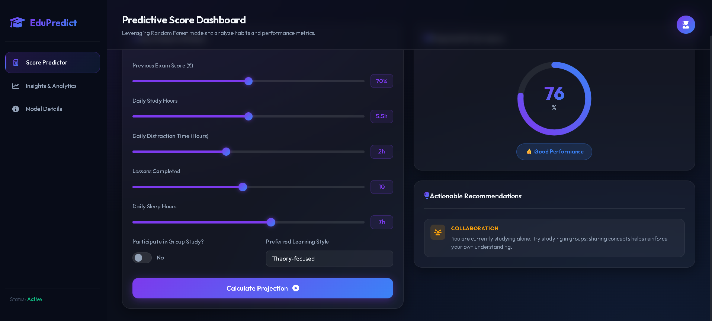
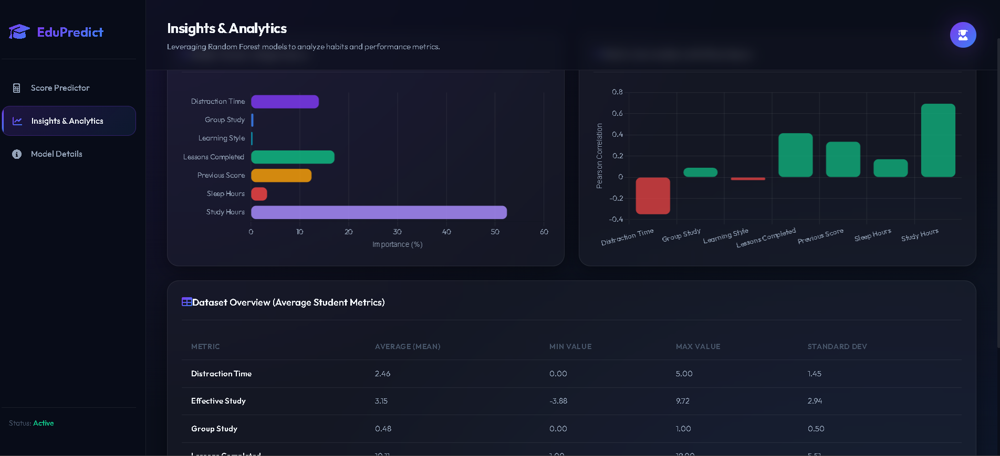
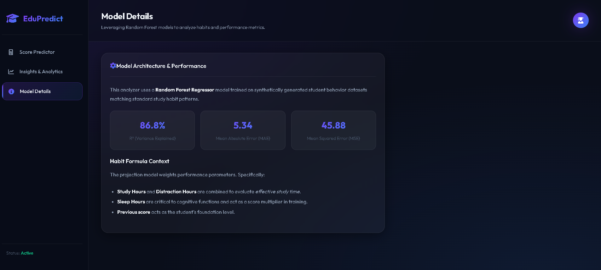

# 🎓 EduPredict — Student Performance Predictor & Analyzer

An AI-powered educational analytics platform that predicts student academic performance using Machine Learning and provides personalized recommendations to improve learning outcomes.

EduPredict combines predictive analytics, behavioral insights, and interactive data visualization into a modern web dashboard designed to help students understand how their study habits impact future exam performance.

---

## 🚀 Features

✅ Student score prediction using Machine Learning

✅ Personalized improvement recommendations

✅ Interactive analytics dashboard

✅ Feature importance visualization

✅ Correlation analysis of study habits

✅ REST API for prediction and analytics

✅ Modern glassmorphic UI

✅ Real-time score forecasting

✅ Performance badge classification

---

## 📌 Project Overview

EduPredict predicts a student's expected exam score using behavioral and academic metrics such as:

* Previous Exam Score
* Study Hours
* Distraction Time
* Lessons Completed
* Sleep Hours
* Group Study Participation
* Learning Style

The application uses a trained Random Forest Regression model to estimate performance and generate actionable recommendations before exams occur.

---

## 📸 Dashboard Preview

### 🎯 Score Predictor

The Score Predictor allows students to enter their academic and behavioral metrics and instantly receive a predicted exam score along with personalized recommendations.



---

### 📊 Insights & Analytics

The Analytics Dashboard provides feature importance analysis, correlation insights, and dataset statistics to help understand which factors most influence student performance.



---

### 🧠 Model Details

The Model Details section presents the machine learning architecture, evaluation metrics (R², MAE, MSE), and explains how the Random Forest model generates predictions.



---


## 🧠 Machine Learning Model

### Algorithm

**Random Forest Regressor**

```python
RandomForestRegressor(
    n_estimators=100,
    random_state=42
)
```

Random Forest combines multiple decision trees and averages their outputs to generate highly accurate regression predictions while reducing overfitting.

---

## 🎯 Why Random Forest?

| Advantage                | Description                                                         |
| ------------------------ | ------------------------------------------------------------------- |
| Handles Non-Linearity    | Captures complex relationships between study habits and performance |
| Robust to Noise          | Performs well on imperfect behavioral data                          |
| Feature Importance       | Provides insights into influential learning factors                 |
| No Scaling Required      | Tree-based architecture simplifies preprocessing                    |
| High Predictive Accuracy | Strong performance with minimal tuning                              |

---

## 📊 Model Performance

The model was evaluated on a held-out test set containing 20% of the dataset.

| Metric                    | Value  |
| ------------------------- | ------ |
| R² Score                  | 0.8678 |
| Mean Absolute Error (MAE) | 5.34   |
| Mean Squared Error (MSE)  | 45.88  |

### Interpretation

* Explains approximately **86.8%** of score variance.
* Average prediction error is only **±5.34 marks**.
* Demonstrates strong predictive capability on unseen student data.

---

## 📚 Dataset Information

### Dataset Source

The dataset is synthetically generated using NumPy distributions calibrated to simulate realistic student learning behaviors.

### Dataset Statistics

| Property          | Value          |
| ----------------- | -------------- |
| Total Records     | 1,000 Students |
| Input Features    | 8              |
| Computed Features | 1              |
| Target Variable   | Final Score    |

---

## 📋 Feature Description

| Feature           | Description                     |
| ----------------- | ------------------------------- |
| previous_score    | Previous exam score             |
| study_hours       | Daily study duration            |
| distraction_time  | Daily time lost to distractions |
| lessons_completed | Number of completed lessons     |
| sleep_hours       | Average sleep duration          |
| group_study       | Participation in group study    |
| learning_style    | Theory or Practice              |
| effective_study   | Study Hours − Distraction Time  |

### Target Variable

```text
score
```

Predicted final examination score ranging from **0–100**.

---

## 📈 Feature Importance Analysis

The trained Random Forest model identified the following factors as most influential:

| Rank | Feature           | Importance |
| ---- | ----------------- | ---------- |
| 🥇   | Study Hours       | 52.45%     |
| 🥈   | Lessons Completed | 17.10%     |
| 🥉   | Distraction Time  | 13.93%     |
| 4    | Previous Score    | 12.40%     |
| 5    | Sleep Hours       | 3.30%      |
| 6    | Group Study       | 0.52%      |
| 7    | Learning Style    | 0.30%      |

### Key Insight

Study Hours alone contribute over **50%** of the predictive power of the model.

---

## 📊 Correlation Analysis

Relationship between each feature and final score:

| Feature           | Correlation |
| ----------------- | ----------- |
| Effective Study   | +0.776      |
| Study Hours       | +0.694      |
| Lessons Completed | +0.416      |
| Previous Score    | +0.335      |
| Sleep Hours       | +0.170      |
| Group Study       | +0.090      |
| Distraction Time  | −0.349      |

### Observation

Effective Study Time is the strongest predictor of student success, while increased distraction time negatively impacts performance.

---

## 🏗️ System Architecture

```text
Student Inputs
       ↓
Flask Backend
       ↓
Feature Processing
       ↓
Random Forest Model
       ↓
Score Prediction
       ↓
Recommendation Engine
       ↓
Analytics Dashboard
```

---

## 💡 Recommendation Engine

EduPredict automatically analyzes user behavior and generates targeted recommendations.

| Condition                        | Category               | Impact |
| -------------------------------- | ---------------------- | ------ |
| Sleep Hours < 7                  | Sleep                  | High   |
| Distraction Time > 2.5           | Distractions           | High   |
| Study Hours < 4                  | Study Habits           | High   |
| No Group Study                   | Collaboration          | Medium |
| Low Previous Score + Few Lessons | Curriculum             | High   |
| None Triggered                   | Positive Reinforcement | Low    |

### Example Recommendation

```text
Reduce daily distractions and increase focused study time.
Your current distraction level may significantly impact future performance.
```

---

## 🌐 API Endpoints

### Home Page

```http
GET /
```

Loads the main dashboard interface.

---

### Predict Student Score

```http
POST /api/predict
```

Request:

```json
{
  "previous_score": 75,
  "study_hours": 6.5,
  "distraction_time": 1.5,
  "lessons_completed": 12,
  "sleep_hours": 7.5,
  "group_study": 1,
  "learning_style": "practice"
}
```

Response:

```json
{
  "predicted_score": 89.59,
  "recommendations": [
    {
      "category": "General",
      "impact": "low",
      "text": "Keep up the good work!"
    }
  ]
}
```

---

### Analytics Endpoint

```http
GET /api/analytics
```

Returns:

* Model Metrics
* Dataset Statistics
* Feature Importances
* Correlation Analysis

---

## 📂 Project Structure

```text
Student-Performance-Predictor-and-Analyzer/
│
├── dataset.py
├── data.csv
├── train.py
├── student_model.joblib
├── app.py
│
├── templates/
│   └── index.html
│
├── static/
│   ├── css/
│   │   └── style.css
│   │
│   └── js/
│       └── main.js
│
└── README.md
```

---

## 🛠️ Technology Stack

| Layer               | Technology              |
| ------------------- | ----------------------- |
| Language            | Python                  |
| Machine Learning    | Scikit-Learn            |
| Backend             | Flask                   |
| Frontend            | HTML5, CSS3, JavaScript |
| Charts              | Chart.js                |
| Data Processing     | Pandas, NumPy           |
| Model Serialization | Joblib                  |
| Icons               | Font Awesome            |
| Styling             | Glassmorphism UI        |

---

## ⚙️ Installation

Clone repository:

```bash
git clone https://github.com/your-username/EduPredict.git
cd EduPredict
```

Install dependencies:

```bash
pip install -r requirements.txt
```

---

## 🚀 Running the Application

### Generate Dataset

```bash
python dataset.py
```

### Train Model

```bash
python train.py
```

### Start Server

```bash
python app.py
```

Open:

```text
http://127.0.0.1:5000
```

---

## 🎓 Educational Insights

The project demonstrates:

* Regression Modeling
* Ensemble Learning
* Feature Importance Analysis
* Correlation Analysis
* REST API Development
* Data Visualization
* Recommendation Systems
* Full Stack AI Application Development

---

## 🚀 Future Enhancements

* Real Student Data Integration
* CSV Upload Support
* Multi-Subject Prediction
* User Accounts & History Tracking
* SHAP Explainability Visualizations
* XGBoost Regression
* Cloud Deployment
* AI Study Planner Integration

---

## 👨‍💻 Author

**Lithesh**

Machine Learning Enthusiast | AI Developer | Full Stack AI Developer

⭐ If you found this project useful, consider giving it a star on GitHub.
